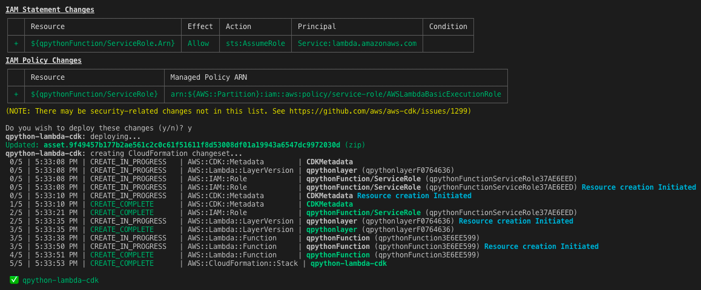

# qPython for AWS Lambda
  
This repository contains the AWS CDK code to deploy qPython to AWS Lambda. 

QPython: [https://qpython.readthedocs.io/en/latest/](https://qpython.readthedocs.io/en/latest/)

AWS CDK: [https://docs.aws.amazon.com/cdk/latest/guide/work-with-cdk-python.html](https://docs.aws.amazon.com/cdk/latest/guide/work-with-cdk-python.html)
 
The host and port for the target q/kdb process are provided using -c (context). The contexts are then used to create environment variables in the lambda environment which are read from qpython_connect.py.

To deploy the qpython lambda stack to your AWS account, run the following.
```
cdk deploy qpython-lambda-cdk -c host=12.34.567.89 -c port=5001
```


To destroy, run the following
```
cdk destroy qpython-lambda-cdk
```
To create a Cloud Formation template for the qpython lambda function, run the following
```
cdk synth qpython-lambda-cdk
